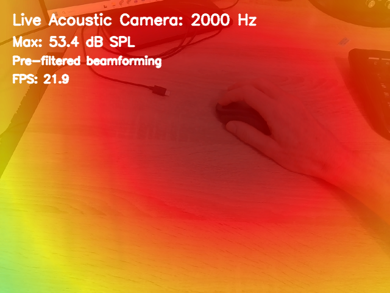
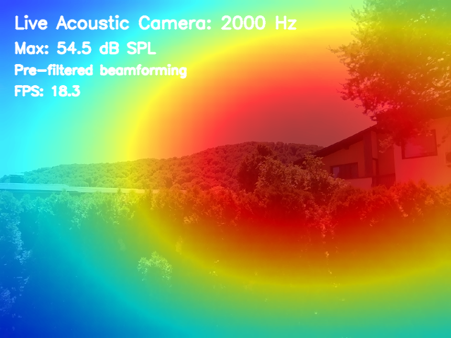

# Acoustic Camera Applications for miniDSP UMA-16

Real-time acoustic visualization applications using the miniDSP UMA-16 microphone array and video camera.

These applications overlay acoustic heatmaps on live video to visualize sound source locations.

Tracking mouse clicks:



Guess where is the sparrow?



## Hardware Requirements

- **miniDSP UMA-16** - [16-channel microphone array](https://www.minidsp.com/products/usb-audio-interface/uma-16-microphone-array)
- **USB Camera** - For video overlay
- **Python Environment** - With Acoular, OpenCV, NumPy, and SoundDevice

## Applications

### 1. [`live_acoustic_camera.py`](live_acoustic_camera.py) - Continuous Streaming (Fast)

#### Algorithm: Pre-Filtered Time-Domain Beamforming

**Processing Pipeline:**
```
Audio Stream (continuous) → Amplification → Octave Filter (2kHz) → Beamforming → RMS Power
```

**How It Works:**
1. **Continuous audio stream** - Single persistent audio source, no recreation
2. **Pre-filtering** - Applies octave band filter at 2 kHz to **each microphone channel independently**
3. **Time-domain beamforming** - Uses `BeamformerTime` on filtered signals to apply spatial delays
4. **RMS power calculation** - Computes power at each grid point over time window
5. **Video overlay** - Blends heatmap with camera frame

**Key Characteristics:**
- ✅ **True continuous processing** - Pipeline created once, streams indefinitely
- ✅ **Lower latency** - ~43ms per block (2048 samples at 48 kHz)
- ✅ **More efficient** - No object recreation, lower overhead
- ✅ **Frequency-selective** - Octave band filter isolates target frequency before spatial processing
- 📊 **Pre-filtering approach** - Filters microphones first, then applies beamforming

**Configuration:**
- **Grid:** 41×41 points (0.4m × 0.4m at 0.3m distance)
- **Target Frequency:** 2000 Hz (octave band)
- **Block Size:** 2048 samples
- **Dynamic Range:** 3 dB
- **Amplification:** 10× gain on all channels

---

### 2. [`batched_acoustic_camera.py`](batched_acoustic_camera.py) - Batch Processing (Proof of concept. Robust & Reliable)

#### Algorithm: Frequency-Domain Beamforming

**Processing Pipeline:**
```
Audio Capture (batch) → Amplification → FFT (PowerSpectra) → Beamforming → Spatial Map
```

**How It Works:**
1. **Captures audio in batches** - Takes 10 blocks of 1024 samples per frame
2. **Frequency decomposition** - Computes FFT cross-spectral matrix using `PowerSpectra`
3. **Frequency-selective beamforming** - Uses `BeamformerBase.synthetic()` at 2 kHz
4. **Spatial mapping** - Converts beamformer output to 2D acoustic heatmap
5. **Video overlay** - Blends heatmap with camera frame

**Key Characteristics:**
- ✅ **Proven accuracy** - Correct spatial tracking of sound sources
- ✅ **Frequency-selective** - Targets specific frequency (2 kHz)
- ✅ **Stable results** - FFT-based approach provides clean spatial maps
- ⚠️ **Batch processing** - Recreates audio pipeline each frame for finite data chunks
- ⚠️ **Latency** - ~213ms per batch (10,240 samples at 48 kHz)

**Configuration:**
- **Grid:** 41×41 points (0.4m × 0.4m at 0.3m distance)
- **Target Frequency:** 2000 Hz
- **Block Size:** 1024 samples
- **Blocks per Frame:** 10
- **Dynamic Range:** 3 dB
- **Amplification:** 10× gain on all channels

---

## Algorithm Comparison

| Aspect | `batched_acoustic_camera.py` | `live_acoustic_camera.py` |
|--------|----------------------------|----------------------------------|
| **Processing Domain** | Frequency (FFT) | Time (filtered signals) |
| **Pipeline Recreation** | Every frame | Once at startup |
| **Beamformer** | `BeamformerBase` | `BeamformerTime` |
| **Frequency Selection** | Post-FFT bin selection | Pre-beamforming octave filter |
| **Latency** | ~213ms (10 blocks) | ~43ms (1 block) |
| **Data Mode** | Batch (finite chunks) | Streaming (continuous) |
| **Performance** | Moderate (object recreation) | High (persistent pipeline) |
| **Spatial Accuracy** | Proven, FFT-based | Good, filter-then-beamform |
| **Use Case** | Reliable reference | Real-time, low-latency |

---

## Key Technical Details

### Frequency Limitations
The UMA-16 array geometry at the configured grid spacing supports accurate beamforming up to approximately **2 kHz**. 
Above this frequency, spatial aliasing and sidelobes reduce accuracy.

### Grid Configuration
Both use a small, close-range grid optimized for near-field sources:
- **Spatial Coverage:** 40cm × 40cm
- **Focus Distance:** 30cm from array
- **Resolution:** 1cm grid spacing
- **Total Points:** 1,681 (41×41)

---

## Dependencies and Installation
The current dependencies are:
```
python >= 3.10.9
acoular>=26.0
opencv-python>=4.13
numpy>=2.2
sounddevice>=0.5
scipy>=1.15
```

I recommend creating a virtual environment, and installing all dependencies there.

For example, in Windows:
```cmd
python -m venv .venv
.venv\Scripts\Activate.ps1
pip install -r requirements.txt
```

---

## Usage

### Running the Applications

**Batch Processing (Reliable):**
```bash
python batched_acoustic_camera.py
```

**Continuous Streaming (Fast):**
```bash
python live_acoustic_camera.py
```

Both applications will:
1. Auto-detect the UMA-16 device (16-channel audio interface)
2. Open camera at index 1
3. Display real-time acoustic heatmap overlay
4. Press **CTRL-C** to quit

---

## Performance Notes

- **Frame Rate:** The live camera achieves around 20 FPS on my system, while the batched one achieves around 5 FPS.
- **CPU Usage:** `live_acoustic_camera.py` is more CPU-efficient due to persistent pipeline
- **Memory:** Both maintain minimal memory footprint with no caching enabled
- **Latency:** Continuous streaming version has ~5× lower latency


## Customisation

### Configuration

Edit the following constants at the top of each file:

```python
UMA16_DEVICE_INDEX = None    # Auto-detect, or specify device index
NUM_CHANNELS = 16            # UMA-16 channel count
CAMERA_INDEX = 1             # Camera device index
TARGET_FREQ = 2000.0         # Target frequency in Hz
BLEND_ALPHA = 0.75           # Heatmap opacity (0-1)
```

For different spatial coverage, adjust the grid:
```python
rg = ac.RectGrid(
    x_min=-0.2, x_max=0.2,   # Horizontal range (meters)
    y_min=-0.2, y_max=0.2,   # Vertical range (meters)
    z=0.3,                    # Focus distance (meters)
    increment=0.01            # Grid spacing (meters)
)
```

---

## Technical References

- **Acoular Library:** [acoular.org](https://acoular.org)
- **miniDSP UMA-16:** [minidsp.com/products/acoustic-cameras/uma-16](https://www.minidsp.com/products/acoustic-cameras/uma-16)
- **Beamforming Theory:** Christensen & Hald - "Beamforming" (2004)

---

## License

These applications are provided as-is for educational and research purposes.


